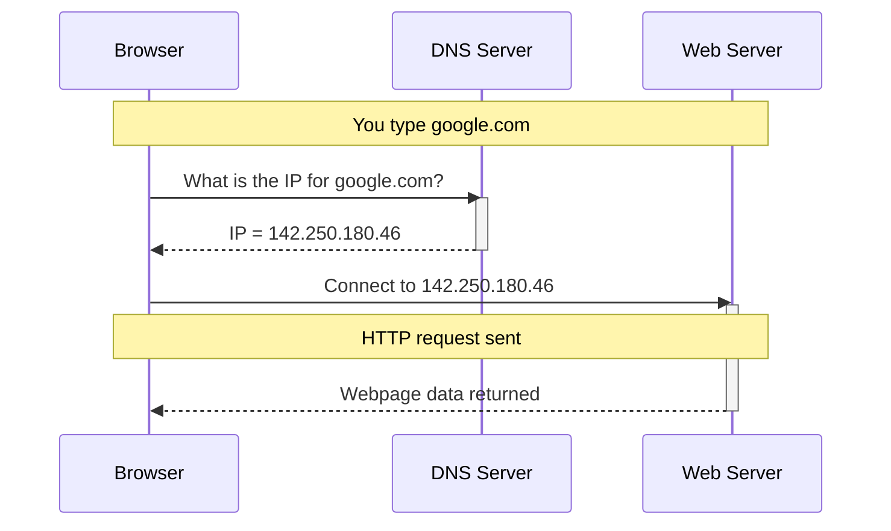
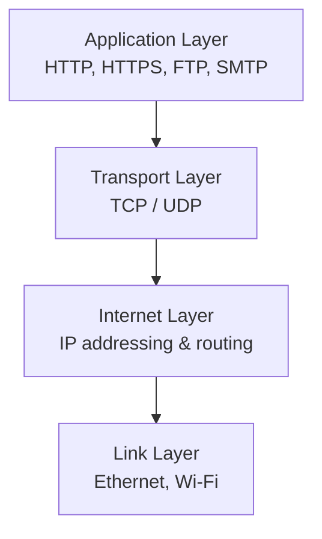

# Mermaid Diagram Guidelines — GCSE CS OCR

> **See also:** [Mermaid Rendering Pipeline](mermaid-rendering-pipeline.md) — detailed reference for the Node.js post-processing steps (emoji compensation, node padding, edge adjustment, theme system).

## Theme System

### No hardcoded colours
- NEVER use `classDef`, `class`, or `style fill:` directives in mermaid source
- All colouring is handled by `patchMermaidSvgs()` in `lesson.html`
- The patch function runs after every `mermaid.run()` and on `themeChanged` event

### How theming works
1. `renderMermaid()` detects `body.light-theme` class, sets `theme: "base"` with `themeVariables`
2. `mermaid.run()` renders the SVG
3. `patchMermaidSvgs()` post-processes every SVG:
   - **Removes the SVG's `<style>` tag entirely** — mermaid's scoped `#mermaid-xxx` ID rules beat everything, so we delete them and set all colours via inline attributes
   - Applies node palette (6 colours, cycling) to flowchart nodes and actor boxes
   - Sets all text to `#475569` (neutral slate, readable on both light and dark backgrounds)
   - Styles edge paths, message lines, lifelines, edge labels, and arrow markers
   - Themes subgraph/cluster backgrounds and titles
   - Themes note boxes (sequence diagram notes)
   - Forces white text on dark-coloured node backgrounds

### Colour palettes
| Element | Light Mode | Dark Mode |
|---------|-----------|-----------|
| Node fills (cycling) | `#0891b2` `#0d9488` `#7c3aed` `#db2777` `#ea580c` `#16a34a` | `#22d3ee` `#2dd4bf` `#a78bfa` `#f472b6` `#fb923c` `#4ade80` |
| All text | `#181f29` | `#181f29` |
| Edge lines / arrows | `#64748b` | `#94a3b8` |
| Subgraph bg | `#f1f5f9` | `#0f172a` |
| Subgraph border | `#cbd5e1` | `#334155` |
| Note bg | `#fef3c7` | `#422006` |
| Note border | `#f59e0b` | `#d97706` |
| Note text | `#92400e` | `#fde68a` |
| Edge label bg | `#ffffff` | `#1e293b` |
| Edge label border | `#cbd5e1` | `#334155` |
| Actor lifelines | `#cbd5e1` | `#475569` |

## Diagram Style Rules

### Keep it simple — GCSE level
- 3-4 participants/actors max in sequence diagrams
- No TCP handshake, no TLS, no hierarchical DNS — too advanced
- Flowcharts: simple top-down or left-right, no complex subgraphs
- No emojis in node labels (they break mermaid rendering)
- No `autonumber` — adds visual clutter

### Node labels
- Use `["Label text"]` syntax for flowchart nodes
- Keep labels short — 1-2 lines max with `<br/>`
- Abbreviate where possible: `TCP / UDP` not `TCP (reliable) or UDP (fast)`
- Use `&` not `and` to save space: `IP addressing & routing`
- CSS provides `padding: 6px 14px` on `.label` and `.nodeLabel`

### Sequence diagrams
- Use `participant X as Name` for clear actor names
- Use `Note over X,Y: text` for annotations
- Use `activate`/`deactivate` for lifelines
- Use `->>` for solid arrows, `-->>` for dashed (responses)

### Flowcharts
- Use `flowchart TD` (top-down) or `flowchart LR` (left-right)
- Use `-->` for arrows
- Use `subgraph Title["Display Title"]` for grouping
- Use `direction LR` inside subgraphs for horizontal layout
- Use `nodeSpacing: 50, rankSpacing: 40` for comfortable spacing

## Technical Notes

### Mermaid library
- Vendored locally at `/static/js/mermaid.min.js` (v10, 3.3MB)
- No CDN dependency — works offline
- Loaded in `lesson.html` and `tutor.html`

### Re-render on theme toggle
- `app.js` `setThemeBase()` dispatches `themeChanged` custom event
- `lesson.html` listener restores `data-source` mermaid text, clears `data-processed`, re-calls `renderMermaid()`
- 50ms `setTimeout` to let DOM settle before re-render

### CSS overrides
```css
.lesson-content .mermaid .label,
.lesson-content .mermaid .nodeLabel {
  padding: 6px 14px !important;
}
.lesson-content .mermaid .label foreignObject,
.lesson-content .mermaid .nodeLabel foreignObject {
  overflow: visible !important;
}
.lesson-content .mermaid .label div,
.lesson-content .mermaid .nodeLabel div {
  padding: 6px 14px !important;
}
```

## Example: Good GCSE-level diagram

### DNS Sequence (lesson 26)


### TCP/IP Layers (lesson 26)

